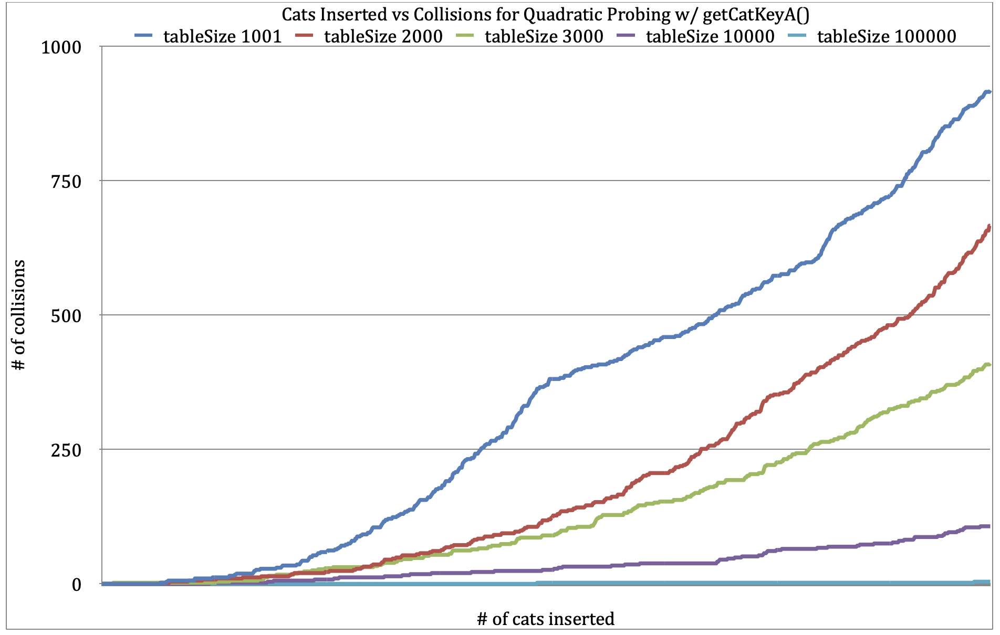
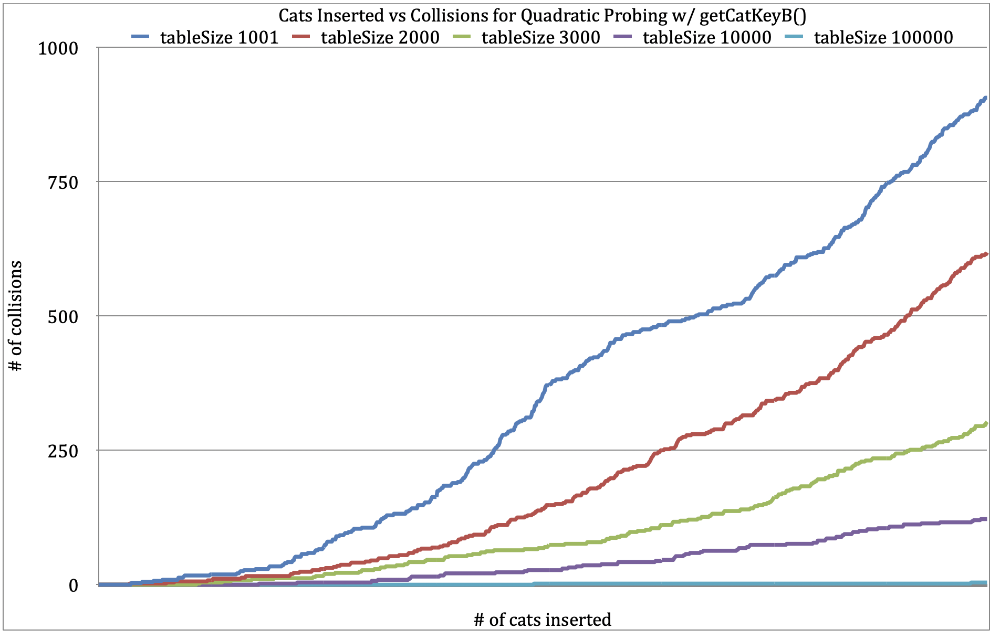
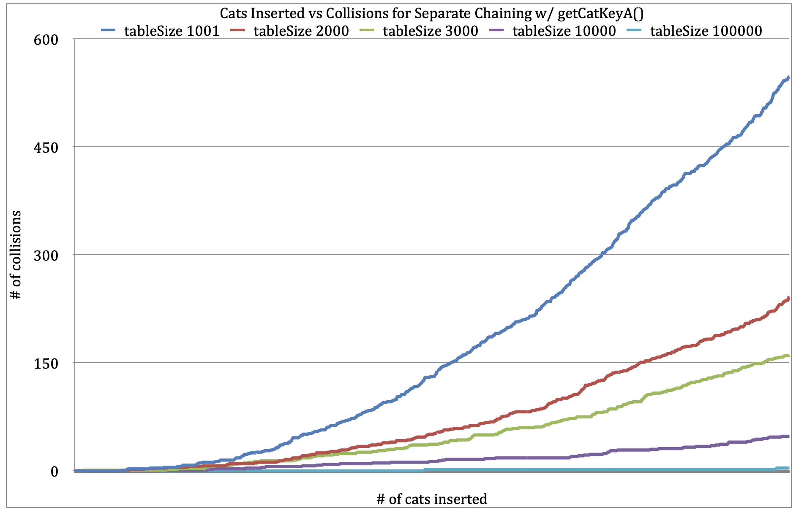
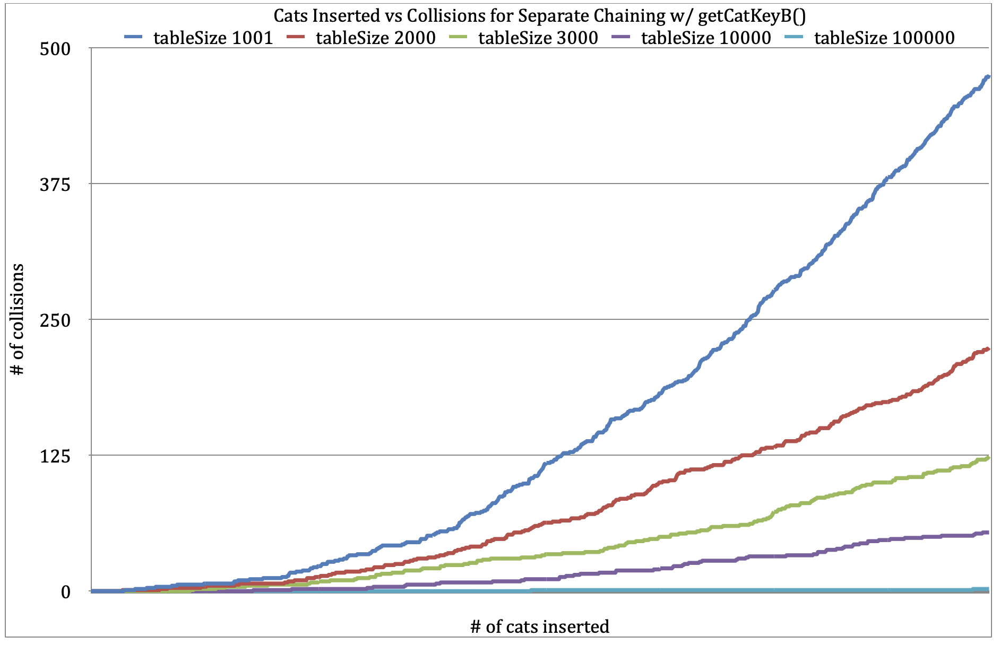

# Project 5 Report

Answer the following prompts directly in this file:
* Information about your dataset. You will be assigned a different grader for this project.

My dataset is about cats.

EX:

Id, Breed, Age (Years), Weight (kg), Color, Gender

1, Russian Blue, 19, 7, Tortoiseshell, Female

* Using the graphs, analyze why the collision counts are different for the different size hash tables. Use what you know about your keys and the hash tables to justify why the collision counts make sense.

The number of collisions are different for each size hash table because the larger hash tables have more unique areas for the keys to hash to.

When you modulo the hash value with the table size, the range of possible outputs is 0 to tableSize - 1. If you have a larger table size the range of indices that the key could hash to is larger. 

* Determine which global function works best as the key for your dataset objects based on the collision counts.

getCatKeyB works better because it has less collisions for separate chaining and about the same for quadratic probing.

* Draw conclusions about which hash collision detection method works best on your dataset (separate chaining or open addressing).

Separate chaining works a lot better than quadratic probing. The graphs display that separate chaining had around 500-600 collisions and quadratic probing had 800-900.

**Note: Any code that was not authored by yourself or the instructor must be cited in your report. This includes the use of concepts not taught in lecture.**